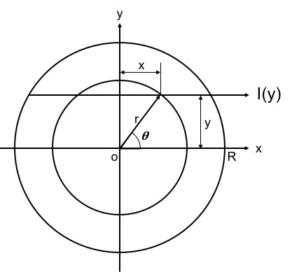
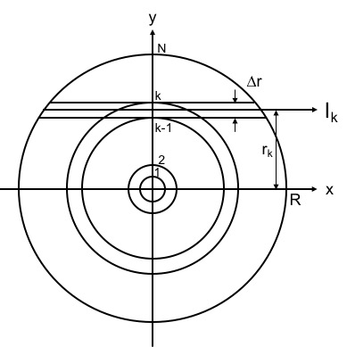

Reconstruction
=================================
## Principle of Abel transform
### 完全対称アーベル変換



```math
F(y)=2\int_y^\infty \frac{f(r)r\,dr}{\sqrt{r^2-y^2}}.
```




## Contents
- [３視線干渉計測から２次元密度分布の再構成するモジュール](ne_profile_r2.py)
    - ガウスモデルを仮定
- [ガウスモデルを元にした２次元分布から線積分密度を求めるモジュール](sightline_ne.py)
- [線積分計測をアーベル変換して局所値を求めるモジュール](Abel_ne.py)
- [分光器のスペクトルからイオン温度・フロー速度を求めるモジュール](Spectroscopic_Analysis.py)

## Usage

## ToDo
- [x] SXのスペクトルのアーベル変換
- [x] 分光計測のスペクトルのアーベル変換
- [ ] 分光，各種イオンの温度・フロー速度を求める処理を追加
- [x] ポリクロメータの時間変化のアーベル変換
- [ ] [Abel_ne.py](Abel_ne.py)の構成を見直す（モジュールを分割orクラスを分割）

## License
Copyright &copy; 2018 Naoki Kenmochi

